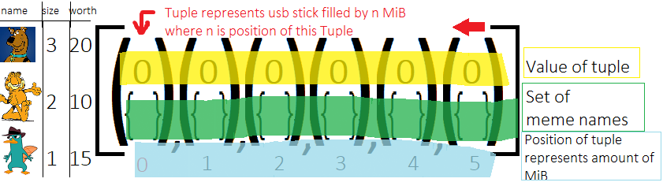
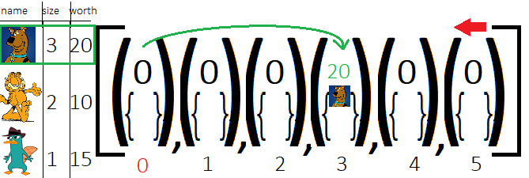
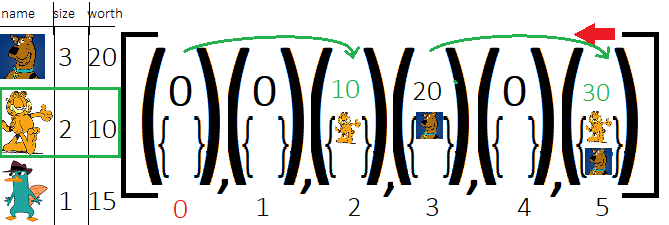
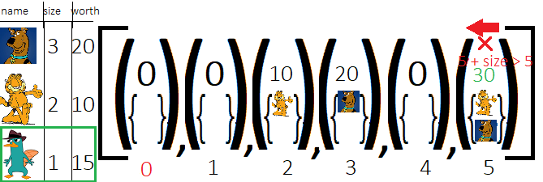
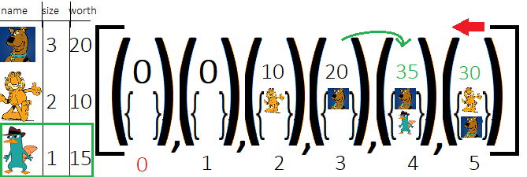
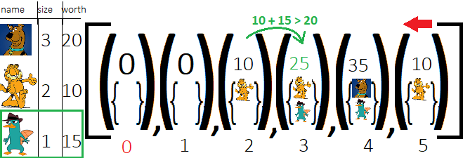
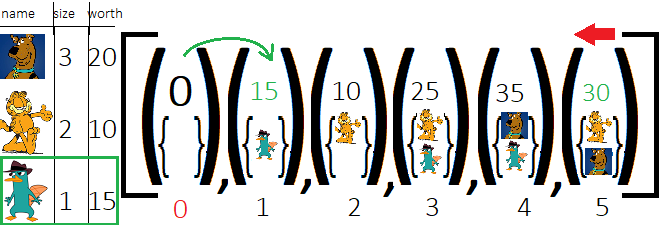

# Clearcode Python Intern 2019 task

Dark times have come. Article 13 has been passed almost 2 years ago. Memes are illegal. People use USB sticks to store and sell them for caps. Every meme is identified by a size, given in MiB, and its market price. xXxDankScavengerxXx sells memes as his way of earning a living. Help him by writing function calculate(usb_size, memes) that calculates the best set of memes, so that he can sell the USB stick for the highest price. 

 - usb_size: int a number describing the capacity of the USB stick in 
   GiB - e.g. 1 means a USB 	 with 1 GiB capacity.

 - memes: List[Tuple[str, int, int]] is a list of 3-element tuples, each
   with the name, size in MiB, and price in caps of a meme: e.g.
   [('dolan.png', 126, 5), ('expanding_brain.jpeg', 421, 10)] which
   means that the xXxDankScavengerxXx has two memes to sell: 'dolan.png'
   which is 126 MiB and can be 		sold for 5 caps and
   'expanding_brain.jpeg' which is 421 MiB and can be sold for 10 caps.

The function should return a tuple with the first element being the total value of all memes on the USB stick, and the second being the set of names of the memes that should be copied onto the USB stick to maximize its value. e.g. (15, {'dolan.png', 'expanding_brain.jpeg'}) Means that the USB stick can be sold for 15 caps if it contains 'dolan.png' and 'expanding_brain.jpeg'.
## Table of Contents

1. [Description of files in folder](#files)
2. [Calculate in main.py algorithm explain](#algorithm)


## Files <a name = "files"></a>
main.py - Python file with calculate function

requirements.txt - File with requirements to main.py

tests.py - Python file with tests to calculate

testpassed.txt - File, that creates after running tests.py. You can check there shortened info about passing tests.

testlog.txt - File, that creates after running tests.py. You can check info about every test. What was expected output of this test, what was returned from calculate function, and others.

handtests.py - Python file with hand tests to calculate

/images - Folder with images to this readme.

## Calculate Algorithm <a name = "algorithm"></a>

At first let's see how this algorithm works on lesser scale. 
Let's have usb_size = 5MiB \
memes = [("ScoobyDoo.png", 3, 20), ("Garfield.png", 2, 10,), ("PerryThePlatypus.agent", 1, 15)]

Let's start by setting up list with usb_size + 1 Tuples with value of memes and empty set for meme names \
Tuple at position n represents usb stick filled by n MiB
<br/><br/>
Our objective is to fill every tuple with memes, that tuple at position n will be filled by n MiB, and tuple will have highest possible value\
If this tuple at position n will have value = 0 and it won't be tuple at position 0 - It will mean that there is no possibility to fill usb stick with memes which size sums to n \
We will do this by using following algorithm: 
- Pick next meme on the list
- Search List of tuples backwards whether tuple meets these 3 logical statements: 
> - Tuple's value is greater than 0 or Tuple's position equals 0
> - Tuple's position + meme_size <= usb_size
> - Tuple at position greater by meme_size has value lower than (Value of Tuple we are searching for + meme_worth)
- If Tuple meets those 3 statements, then we update tuple greater by meme size 
> - Updating is saying that, if we get all memes in tuple we are looking at, and then we add meme we have picked to them, this subset will be better than subset that is in tuple at position greater by meme size 
<a/>
So we pick first meme on list: It's Scooby Doo, with size 3 and worth 20 <br/>
We loop through the whole list from backwards to understand that only Tuple at position 1 meets those 3 logical statements and then we update tuple at position 3, because 0 + 3 = 3.

Now we pick Garfield, which size = 2 and worth = 10 <br/>
Following the previous rules, By looping through the list backwards, we get to know that Tuple at position 3 meets those 3 logical  statements, so we update tuple at position 3 + 2 <br/>
And also Tuple at position 0 meets these 3 logical statements, so we update tuple at position 0 + 2. 
 <br>
Now we will take it slow,  <br>
We pick Perry The Platypus, which size is 1 and worth is 15.  <br>
By looping through the whole list backwards, we see that Tuple at position 5 doesn't meet the statement, that <br/> 
Tuple's position + meme size > usb_size

Then we get to know that tuple at position 3 meets the statements, so we update tuple at position 4.

Then we get to know that tuple at position 2 meets the statements, so we update tuple at position 3.

Tuple at position 0 also meets the statements, so we update tuple at position 1.

In the end, we find maximum value in this list 
<br/><br/>

In calculate function, we also start from setup

```python
  tab = [] 
    for i in range(usb_size+1):
        tab.append([0, set([])])
```
And then for every meme, check every position backwards, about those 3 logical statements mentioned earlier
```python
    for meme in memes:
        for pos in range(usb_size,-1,-1):
            if (pos + meme[SIZE] <= usb_size and (tab[pos][VALUE] != 0 or pos == 0) and
                tab[pos + meme[SIZE]][VALUE] < tab[pos][VALUE] + meme[WORTH]):
```
If they meet those 3 statements, then we update tuple with position greater by meme's size
```python
                tab[pos + meme[SIZE]][VALUE] = tab[pos][VALUE] + meme[WORTH]
                tab[pos + meme[SIZE]][NAMES] = set([])
                for name in tab[pos][NAMES]:
                    tab[pos + meme[SIZE]][NAMES].add(name)
                tab[pos + meme[SIZE]][NAMES].add(meme[NAME])
```
In the end, we find maximum value in list and return it in requested format
```python
    best_answer = tab[0] 
    for answer in tab:
        if answer[VALUE] > best_answer[VALUE]:
            best_answer = answer
        # return Tuple(int, Set(string*))
    return (best_answer[VALUE], best_answer[NAMES]) 
```
